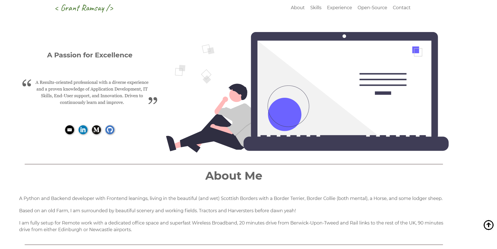

# Developers Portfolio Website

A totally stand-alone React based developers portfolio website, taking all data
from a local JSON file.

This is still work in progress but fully able to be used live. I try to avoid
any breaking changes in the configuration file, this will be noted in the
changelog if required.

## Sections

- Hero section
  - A Tagline and brief statement of your philosophy.
- About Me
  - A brief couple of paragraphs to describe/sell yourself.
- My Skills
  - Displays brief info about the main relevant Skills you have, and a list of
    other perhaps lesser but still relevant skills.
- My Experience
  - List your Job/Project experience with dates, notable responsibilities etc.
- OpenSource Projects.
  - Queries `Github` (In future I hope to add GitLab and Bitbucket) in real time
    and displays the PUBLIC repositories for the supplied User. You can also
    provide multiple users if you have multiple accounts for example. These can
    be folded away if required.
- Contact Me
  - The final statements and contact information
- Social Media buttons
  - Customisable buttons to link to your Social Media presence.

All of the information contained in the above are fully customisable using the
`settings.js` file, no actual programming or modification to the React code is
needed.

## How to Use

## Still to do

- ~~Contact section.~~
- ~~Social media buttons.~~
- ~~floating back-to-top button.~~
- ~~tweaks and user info to the OpenSource section.~~
- ~~make the menu mobile-responsive.~~
- Add GitLab and Bitbucket integration.
- Add a carousel to showcase notable projects.
- Optional [`AddThis`][addthis] or [`ShareThis`][sharethis] integration.
- Optional [`Google Analytics`][googanal] integration.
- Full instructions in this README.
- more!

There is a live working version on my own pages : [https://www.gnramsay.com](https://www.gnramsay.com)

Licensed under MIT, do with it as you will but please leave my copyright on it.
Pull requests are welcome.

[addthis]: https://www.addthis.com/
[sharethis]: https://sharethis.com/
[googanal]: https://analytics.google.com
