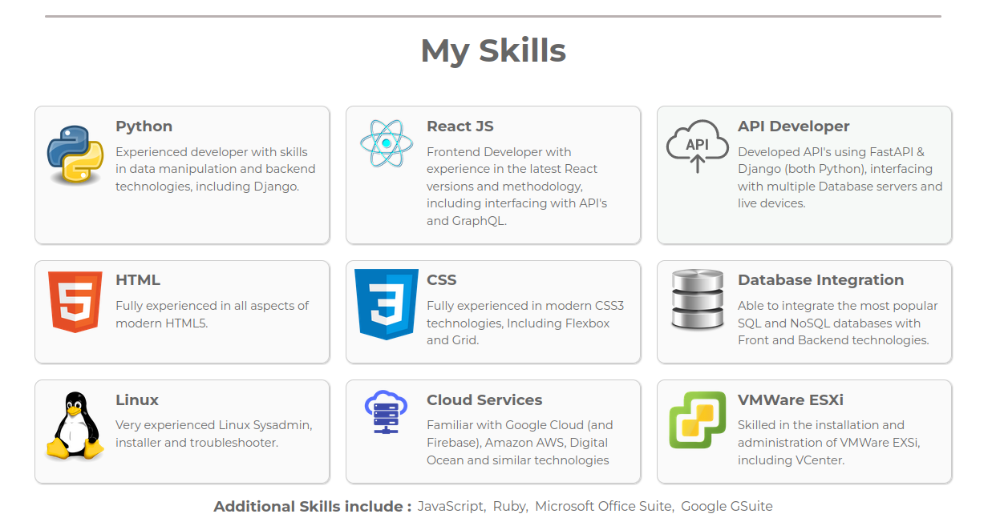
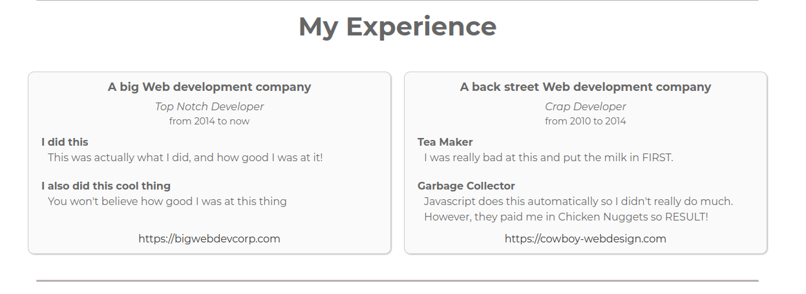

# The Settings file

The settings file is where you configure the portfolio app to your own
requirements. It is a JavaScript file which exports an object containing all the
settings. The file is located at `./src/configure/settings.js`.

## Example Settings

As described in the [installation][installation] section, the portfolio app
comes with an example settings file. This file is located at
`./src/configure/settings.example.js`. You can copy this file to
`./src/configure/settings.js` and then edit it to your own requirements.

## The settings object

The settings object is a JavaScript object which contains all the settings for
the portfolio app. It is exported from the settings file as the default export.

```js
// ./src/configure/settings.js
export const settings = {
  // ...
};
```

This settings object is not set in stone, you can add your own settings to it
and use them in your portfolio app. However, if you remove any of the existing
settings, the app will fail unless you also remove the code that uses them.

## Imports

At the top of the settings file, you will find a number of imports. These are
generally used to import logos and other images which are used in the portfolio.
This way, they will be included in the bundle and available to the app.

You can change these to your own images if you wish, or add new ones, any format
that React can handle is fine. By default, the portfolio app uses PNG and SVG
images.

```js
// The Hero Image
import heroLogo from "/src/assets/svg/undraw_Code_thinking.svg";

// Used in the 'My Skills' section
import apiLogo from "/src/assets/icons/api.svg";
import cloudLogo from "/src/assets/icons/cloud.png";
import cssLogo from "/src/assets/icons/css3.png";
import databaseLogo from "/src/assets/icons/database.png";
import esxiLogo from "/src/assets/icons/esxi.png";
import htmlLogo from "/src/assets/icons/html5.png";
import linuxLogo from "/src/assets/icons/linux.png";
import pythonIcon from "/src/assets/icons/python.png";
import reactLogo from "/src/assets/icons/react.png";

// Social Icons
import socialBlog from "/src/assets/social/blog.png";
import socialEmail from "/src/assets/social/email.png";
import socialFacebook from "/src/assets/social/facebook.png";
import socialGitHub from "/src/assets/social/github.png";
import socialLinkedIn from "/src/assets/social/linkedin.png";
import socialMedium from "/src/assets/social/medium.png";
import socialSnapchat from "/src/assets/social/snapchat.png";
import socialTikTok from "/src/assets/social/tiktok.png";
import socialTwitter from "/src/assets/social/twitter.png";
import socialYouTube from "/src/assets/social/youtube.png";
```

## 'Meta' Sections

There are a couple of settings at the top that you should change to your own
details. These are the `meta` settings, which are used to populate the **meta
tags**, **name**, and **githubUsername** (the latter is used in the 'Open
Source' section to display your repositories nicely).

```js
meta: {
  description: "This is my portfolio",
  link: "https://my-portfolio.com",
},
name: "My Name",
githubUsername: ["my-github-username"],
// ...
```

The `name` value will be used in the title of the page, and in the page header.

Note that the `githubUsername` setting is an array, this is because you can
specify multiple usernames. This is useful if you have multiple GitHub accounts.

## The 'Hero' Section

This is the section that contains the hero image and the text that appears on
top of it. You can change the image and the text to your own.

```js
hero: {
    enabled: true,
    image: heroLogo,
    heading: "A Passion for Excellence",
    message:
      "A Results-oriented professional with a diverse experience and a " +
      "proven knowledge of Application Development, IT Skills, End-User " +
      "support, and Innovation. Driven to continuously learn and improve.",
  },
```

The `image` setting is the name of the imported graphic file that you want to
use as the hero image. The `heading` and `message` settings are the text that
appears at the side of the hero image. This appears as below:


### Social Media Icons

The social media icons are the icons that appear at the bottom of the hero
section above, and also in the `Contact` section at the bottom. You can add as
many or as few as you like, and you can remove any that are not relevant to you.
If you leave the `link` setting as an empty string, the icon will not appear.

```js
social: [
  // change to link to your social medial accounts. If link is blank, they
  // wont be mentioned.
  { name: "Email", link: "mailto:me@hello.com", icon: socialEmail },
  { name: "Blog", link: "https://www.my-amazing-blog.com", icon: socialBlog },
  {
    name: "LinkedIn",
    link: "https://www.linkedin.com/in/my-name/",
    icon: socialLinkedIn,
  },
  {
    name: "Medium",
    link: "https://you.medium.com/",
    icon: socialMedium,
  },
  { name: "GitHub", link: "https://github.com/myuser", icon: socialGitHub },
  {
    name: "YouTube",
    link: "https://youtube.com/myuser",
    icon: socialYouTube,
  },
  { name: "FaceBook", link: "", icon: socialFacebook },
  { name: "SnapChat", link: "", icon: socialSnapchat },
  { name: "TikTok", link: "", icon: socialTikTok },
  {
    name: "Twitter",
    link: "https://twitter.com/myuser",
    icon: socialTwitter,
  },
],
```

## The 'About Me' Section

This is a simple text section that lets the reader know a little about you. You
can put anything here that you fine relevant, but note its more informal
information than the 'My Skills' section.

```js
about: [
    "A Python and Backend developer with Frontend leanings, living in the " +
      "beautiful (and wet) Scottish Borders with a Border Terrier, Border " +
      "Collie (both mental) and a couple of Horses.",
    "Based on an old Farm, I am surrounded by beautiful scenery and working " +
      "fields. Tractors and Harversters before dawn yeah!",
    "I am fully setup for Remote work with a dedicated office space and " +
      "superfast Wireless Broadband, 20 minutes drive from Berwick-Upon-" +
      "Tweed and Rail links to the rest of the UK, 90 minutes drive from " +
      "either Edinburgh or Newcastle airports.",
  ]
```

## The 'My Skills' Section

This section is where you list your skills. You can add as many as you like,
and you can add new icons to the `import` section at the top of the file. You
can also remove any skill that is not relevant to you.

it is an array of objects, each object represents a skill. The `name` setting
is the name of the skill, the `icon` setting is the name of the imported icon
file, and the `desc` setting is a brief description. You can have as many or as
few skills as you like.

```js
skills: [
    {
      name: "Python",
      icon: pythonIcon,
      desc:
        "Experienced developer with skills in data manipulation and " +
        "backend technologies, including Django.",
    },
    {
      name: "React JS",
      icon: reactLogo,
      desc:
        "Frontend Developer with experience in the latest React versions " +
        "and methodology, including interfacing with API's and GraphQL.",
    },
    // ... repeat for each skill
]
```



### Additional Skills

Under the main skills section, there is a section for additional skills. This
is a simple list of skills that you have, but are not necessarily your main
skills. You can add as many as you like, and you can remove any that are not
relevant to you.

```js
additionalSkills: [
  "JavaScript",
  "Ruby",
  "Microsoft Office Suite",
  "Google GSuite",
],
```

## The 'My Experience' Section

This is the section where you list your experience. It is an array of objects,
each object represents a job. The `title` setting is the job title, the `dates`
setting is the dates you worked there, the `company` setting is the name of the
company, the `link` setting is the URL of the company website, and the
`responsibilites` section is another array of objects, each object represents a
responsibility with a `name` and `description`.

```js
experience: [
    {
      title: "Top Notch Developer",
      dates: "2014 to now",
      company: "A big Web development company",
      link: "https://bigwebdevcorp.com",
      responsibilities: [
        {
          name: "I did this",
          desc: "This was actually what I did, and how good I was at it!",
        },
        {
          name: "I also did this cool thing",
          desc: "You won't believe how good I was at this thing",
        },
      ],
    },
    {
      title: "Crap Developer",
      dates: "2010 to 2014",
      company: "A back street Web development company",
      link: "https://cowboy-webdesign.com",
      responsibilities: [
        {
          name: "Tea Maker",
          desc: "I was really bad at this and put the milk in FIRST.",
        },
        {
          name: "Garbage Collector",
          desc:
            "Javascript does this automatically so I didn't really do much. " +
            "However, they paid me in Chicken Nuggets so RESULT!",
        },
      ],
    },
],
```



## The 'Open-Source Projects' Section

If you have specified a `githubUsername` in the meta section (and added a GitHub
**Personal Access Token**), then this section will appear. It is a list of your
**public** GitHub repositories and is automatically generated from your GitHub
account.

By default it shows the 6 '**pinned**' repositories, with the rest appearing
under the 'Show more Public Repositories' toggle, hidden by default. You can
also toggle the complete list of repositories by clicking the inverted chevron
at the top.

You can have several GitHub accounts, and you can specify them all in the
`githubUsername` setting as an array.


## The 'Contact Me' Section

The last section is the 'Contact Me' section. This is a simple paragraph and is
not editable at this time. It shows your social buttons again.

This section will be updated in the future to allow you to add your own
information and links.

[installation]: installation#update-the-configuration
